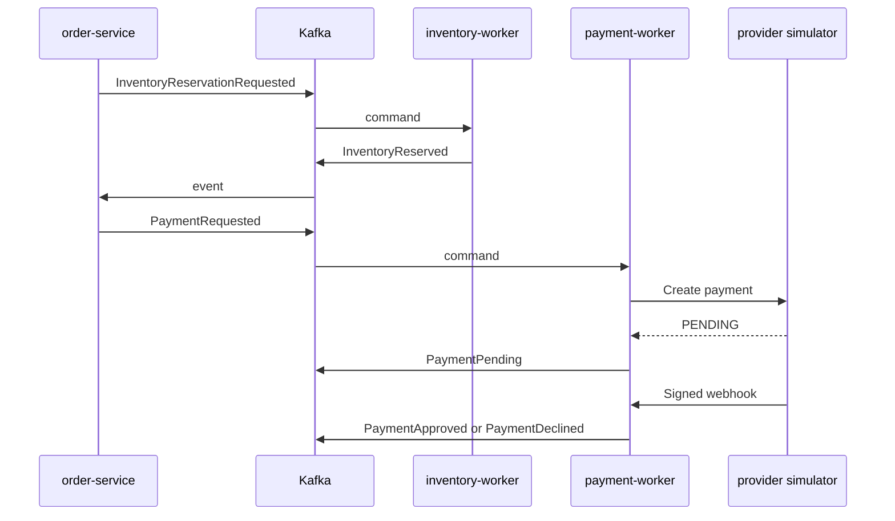

# OrderFlow Event Catalog v1

**Status:** Proposed  
**Date:** 2026-09-13  
**Schema dialect:** JSON Schema Draft 2020-12

## 1. Purpose

This catalog defines the messages exchanged by the first OrderFlow saga. It separates business commands, which request an action, from domain events, which report an outcome that already occurred. It also defines the external payment webhook consumed by `payment-worker`.

The catalog is a source contract. It does not prescribe Java DTO packages or allow one service to import another service's domain model.

## 2. Message topology

| Topic | Producer | Consumer group | Message types |
|---|---|---|---|
| `orderflow.inventory.commands` | `order-service` | `inventory-worker` | `InventoryReservationRequested`, `InventoryReleaseRequested` |
| `orderflow.inventory.events` | `inventory-worker` | `order-service-inventory-events` | `InventoryReserved`, `InventoryRejected`, `InventoryReleased` |
| `orderflow.payment.commands` | `order-service` | `payment-worker` | `PaymentRequested` |
| `orderflow.payment.events` | `payment-worker` | `order-service-payment-events` | `PaymentPending`, `PaymentApproved`, `PaymentDeclined` |

Every record uses `orderId` as its Kafka key. Initial partition counts and retention periods remain deployment decisions. DLQ topics append `.dlq` to the source topic name.

## 3. Common envelope

All Kafka messages use `EventEnvelope.v1`.

| Field | Meaning |
|---|---|
| `eventId` | Unique UUID of this message; used for delivery deduplication. |
| `eventType` | Stable contract name without the version suffix. |
| `eventVersion` | Logical major contract version; initially `1`. |
| `occurredAt` | UTC timestamp at which the command was issued or event occurred. |
| `correlationId` | Saga identifier; equal to `orderId`. |
| `causationId` | UUID of the message or HTTP request that caused this message. |
| `aggregateId` | Primary aggregate affected by this message. |
| `producer` | Service that created the message. |
| `payload` | Contract-specific data. |

The Kafka key is transport metadata and is not duplicated as a special envelope field. Consumers must verify that the record key equals the payload `orderId`.

## 4. Global processing rules

### Delivery and idempotency

- Delivery is at least once.
- Producers persist domain changes and Outbox entries atomically.
- Consumers persist processed `eventId` values together with their domain outcome and outgoing Outbox entries.
- An identical redelivery is acknowledged without a second business effect or a second outcome event.
- Reusing the same business identity with different content is a permanent conflict and goes directly to DLQ.

### Validation and state conflicts

- Schema-invalid messages go directly to DLQ with sanitized diagnostic metadata.
- A schema-valid message that cannot be applied to the current aggregate state does not alter state and goes directly to DLQ.
- Permanent conflicts are not retried.
- Transient infrastructure failures use retry with backoff before DLQ.

### Compatibility

- Schemas reject undeclared fields.
- Optional additive fields can remain in logical version 1 only with an expand-first rollout: consumers accept the field before producers send it.
- Breaking changes create logical version 2 and require an explicit migration plan.
- Repository releases use semantic versioning independently from `eventVersion`.

## 5. Inventory contracts

### 5.1 InventoryReservationRequested.v1

| Attribute | Value |
|---|---|
| Classification | Command |
| Producer | `order-service` |
| Consumer | `inventory-worker` |
| Topic | `orderflow.inventory.commands` |
| Aggregate | Order (`aggregateId = orderId`) |
| Trigger | An order is created and enters `INVENTORY_PENDING`. |

Requests an atomic reservation for already consolidated order items. The consumer must reserve all items or none. The payload contains only `orderId` and item identifiers/quantities; prices and payment data do not cross the inventory boundary.

An identical duplicate is acknowledged without a second reservation. A different item set for an existing `orderId` is a permanent conflict and goes to DLQ.

Possible outcomes: `InventoryReserved.v1` or `InventoryRejected.v1`.

### 5.2 InventoryReserved.v1

| Attribute | Value |
|---|---|
| Classification | Domain event |
| Producer | `inventory-worker` |
| Consumer | `order-service` |
| Topic | `orderflow.inventory.events` |
| Aggregate | Reservation (`aggregateId = reservationId`) |
| Trigger | All requested quantities were reserved atomically. |

Reports the generated `reservationId`, related `orderId`, all reserved items and `reservedAt`. When accepted in `INVENTORY_PENDING`, the orchestrator records the reservation, moves the order to `PAYMENT_PENDING`, and emits `PaymentRequested.v1`.

### 5.3 InventoryRejected.v1

| Attribute | Value |
|---|---|
| Classification | Domain event |
| Producer | `inventory-worker` |
| Consumer | `order-service` |
| Topic | `orderflow.inventory.events` |
| Aggregate | Order (`aggregateId = orderId`) |
| Trigger | One or more requested products cannot be reserved. |

Reports every rejected item with its requested quantity. The initial normalized reason is `INSUFFICIENT_STOCK`, including the case where the product does not exist in the inventory store. No partial reservation remains. The orchestrator moves the order directly to `CANCELLED` and never requests payment.

### 5.4 InventoryReleaseRequested.v1

| Attribute | Value |
|---|---|
| Classification | Compensation command |
| Producer | `order-service` |
| Consumer | `inventory-worker` |
| Topic | `orderflow.inventory.commands` |
| Aggregate | Reservation (`aggregateId = reservationId`) |
| Trigger | Payment is definitively declined after inventory was reserved. |

Contains only `reservationId` and `orderId`. The inventory service is the source of truth for reserved items and recovers them from its own database.

An already released reservation is an idempotent duplicate. A reservation that never existed is a permanent inconsistency and goes directly to DLQ.

### 5.5 InventoryReleased.v1

| Attribute | Value |
|---|---|
| Classification | Domain event |
| Producer | `inventory-worker` |
| Consumer | `order-service` |
| Topic | `orderflow.inventory.events` |
| Aggregate | Reservation (`aggregateId = reservationId`) |
| Trigger | An active reservation is released. |

Reports the reservation, order and released items. The orchestrator accepts it only while the order is `CANCELLATION_PENDING`, then moves the order to `CANCELLED`.

## 6. Payment contracts

### 6.1 PaymentRequested.v1

| Attribute | Value |
|---|---|
| Classification | Command |
| Producer | `order-service` |
| Consumer | `payment-worker` |
| Topic | `orderflow.payment.commands` |
| Aggregate | Order (`aggregateId = orderId`) |
| Trigger | Inventory is reserved and the order enters `PAYMENT_PENDING`. |

Carries `orderId`, `reservationId`, decimal `amount`, ISO currency and an opaque test payment token. The token must never be logged. The `payment-worker` creates `paymentId` before calling the provider and uses it as the provider idempotency key.

### 6.2 PaymentPending.v1

| Attribute | Value |
|---|---|
| Classification | Domain event |
| Producer | `payment-worker` |
| Consumer | `order-service` |
| Topic | `orderflow.payment.events` |
| Aggregate | Payment (`aggregateId = paymentId`) |
| Trigger | The provider accepted the request but did not return a final result. |

Reports internal and external payment identifiers. The order remains `PAYMENT_PENDING`. The event improves auditability and allows the orchestrator to store payment references while waiting for a webhook.

### 6.3 PaymentApproved.v1

| Attribute | Value |
|---|---|
| Classification | Domain event |
| Producer | `payment-worker` |
| Consumer | `order-service` |
| Topic | `orderflow.payment.events` |
| Aggregate | Payment (`aggregateId = paymentId`) |
| Trigger | Immediate provider response or valid webhook confirms approval. |

Reports the final approved amount and currency. The orchestrator verifies them against the order and moves a matching `PAYMENT_PENDING` order to `CONFIRMED`.

### 6.4 PaymentDeclined.v1

| Attribute | Value |
|---|---|
| Classification | Domain event |
| Producer | `payment-worker` |
| Consumer | `order-service` |
| Topic | `orderflow.payment.events` |
| Aggregate | Payment (`aggregateId = paymentId`) |
| Trigger | Immediate provider response or valid webhook confirms decline. |

Uses a normalized `reasonCode` and never exposes the raw provider message. The initial codes are `INSUFFICIENT_FUNDS`, `PAYMENT_METHOD_DECLINED`, `FRAUD_SUSPECTED`, `INVALID_PAYMENT_METHOD`, and `UNKNOWN`.

The orchestrator moves the order to `CANCELLATION_PENDING` and emits `InventoryReleaseRequested.v1`.

### Uncertain provider results

A timeout is not a decline. The worker retries with the same `paymentId`. After retries are exhausted, the command goes to DLQ and payment/order remain pending until the Phase 4 expiration policy resolves the uncertainty.

## 7. External webhook contract

### PaymentWebhook.v1

| Attribute | Value |
|---|---|
| Classification | External HTTP callback |
| Producer | `payment-provider-simulator` |
| Consumer | `payment-worker` |
| Endpoint | `POST /webhooks/v1/payments/provider` |
| Authentication | HMAC-SHA256 |

Required headers:

- `X-Webhook-Id`: provider event identifier and deduplication key.
- `X-Webhook-Timestamp`: Unix timestamp in seconds.
- `X-Webhook-Signature`: lowercase hexadecimal HMAC-SHA256 digest.

The signed bytes are:

```text
X-Webhook-Timestamp + "." + raw HTTP body
```

The receiver accepts timestamps within five minutes of its current clock and compares signatures in constant time.

| Scenario | HTTP result | Domain effect |
|---|---:|---|
| Valid new callback | `200` | Persist receipt and publish normalized payment event through Outbox. |
| Same ID and same payload | `200` | No additional effect or Kafka event. |
| Same ID and different payload | `409` | Integrity alert; no state change. |
| Invalid/expired signature | `401` | Sanitized audit and metric; no state change. |
| Valid status conflicting with final payment | `200` | Audit and conflict metric; no state change or Kafka event. |

## 8. Message flow



## 9. Contract inventory

| Contract | Schema | Valid example | Invalid example |
|---|---|---|---|
| EventEnvelope.v1 | `schemas/common/event-envelope.v1.schema.json` | Covered by every Kafka example | Covered by invalid Kafka examples |
| InventoryReservationRequested.v1 | `schemas/inventory/inventory-reservation-requested.v1.schema.json` | `examples/valid/inventory-reservation-requested.v1.json` | `examples/invalid/inventory-reservation-requested.v1.json` |
| InventoryReserved.v1 | `schemas/inventory/inventory-reserved.v1.schema.json` | `examples/valid/inventory-reserved.v1.json` | `examples/invalid/inventory-reserved.v1.json` |
| InventoryRejected.v1 | `schemas/inventory/inventory-rejected.v1.schema.json` | `examples/valid/inventory-rejected.v1.json` | `examples/invalid/inventory-rejected.v1.json` |
| InventoryReleaseRequested.v1 | `schemas/inventory/inventory-release-requested.v1.schema.json` | `examples/valid/inventory-release-requested.v1.json` | `examples/invalid/inventory-release-requested.v1.json` |
| InventoryReleased.v1 | `schemas/inventory/inventory-released.v1.schema.json` | `examples/valid/inventory-released.v1.json` | `examples/invalid/inventory-released.v1.json` |
| PaymentRequested.v1 | `schemas/payment/payment-requested.v1.schema.json` | `examples/valid/payment-requested.v1.json` | `examples/invalid/payment-requested.v1.json` |
| PaymentPending.v1 | `schemas/payment/payment-pending.v1.schema.json` | `examples/valid/payment-pending.v1.json` | `examples/invalid/payment-pending.v1.json` |
| PaymentApproved.v1 | `schemas/payment/payment-approved.v1.schema.json` | `examples/valid/payment-approved.v1.json` | `examples/invalid/payment-approved.v1.json` |
| PaymentDeclined.v1 | `schemas/payment/payment-declined.v1.schema.json` | `examples/valid/payment-declined.v1.json` | `examples/invalid/payment-declined.v1.json` |
| PaymentWebhook.v1 | `schemas/webhook/payment-webhook.v1.schema.json` | `examples/valid/payment-webhook.v1.json` | `examples/invalid/payment-webhook.v1.json` |

## 10. Decisions intentionally deferred

- Initial Kafka partition count and retention.
- Schema Registry adoption.
- DLQ replay authorization and tooling.
- Reservation and pending payment expiration details.
- HMAC secret rotation.
- Provider refund/cancellation contracts.
